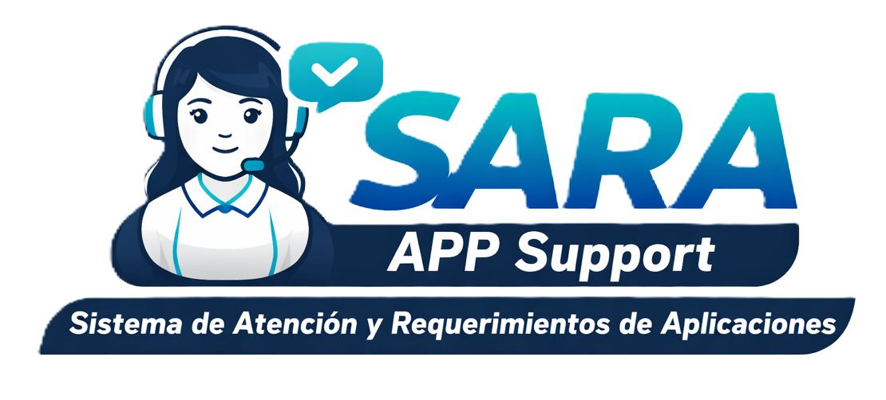

<p align="center">
  
</p>

# SARA — Sistema de Apoyo Remoto de Aplicaciones
**Fundacion Sersocial IPS · Soporte TI**

Sistema interno de gestión de tickets de soporte para aplicaciones de salud, ERP, riesgo y beneficios. Construido en PHP nativo + MySQL, sin dependencias externas (excepto Chart.js vía CDN).

---

## Requisitos

| Componente | Versión mínima |
|---|---|
| PHP | 7.4 |
| MySQL / MariaDB | 5.7 / 10.3 |
| Apache | 2.4 |
| XAMPP (local) | 8.x recomendado |

---

## Instalación

### 1. Clonar / copiar el proyecto

```bash
# Opción A — clonar
git clone <url-del-repo> C:\xampp\htdocs\sara_sersocialips

# Opción B — copiar la carpeta manualmente a:
C:\xampp\htdocs\sara_sersocialips\
```

### 2. Configurar la base de datos

```bash
# Copia el archivo de ejemplo
cp db.example.php db.php
```

Edita `db.php` con tus credenciales MySQL:

```php
define('DB_HOST', 'localhost');
define('DB_USER', 'root');
define('DB_PASS', '');           // tu contraseña
define('DB_NAME', 'helpdesk');
```

> `db.php` está en `.gitignore` — nunca se sube al repositorio.

### 3. Inicializar la base de datos

Con XAMPP activo (Apache + MySQL), abre en el navegador:

```
http://localhost/sara_sersocialips/install.php
```

Esto crea la base de datos `helpdesk` y las tablas base.

### 4. Crear usuarios y agentes por defecto

```
http://localhost/sara_sersocialips/migracion_usuarios.php
http://localhost/sara_sersocialips/migracion_agentes.php
```

> Elimina o restringe estos archivos después de ejecutarlos por primera vez.

### 5. Acceder al sistema

```
http://localhost/sara_sersocialips/
```

---

## Cuentas por defecto

> **Cambia estas contraseñas inmediatamente en produccion.**

| Usuario | Contraseña | Rol |
|---|---|---|
| admin | admin123 | Coordinador |
| agente1 | agente123 | Agente |
| agente2 | agente123 | Agente |
| agente3 | agente123 | Agente |
| agente4 | agente123 | Agente |
| usuario | usuario123 | Usuario |

---

## Roles y permisos

| Accion | Usuario | Agente | Coordinador |
|---|:---:|:---:|:---:|
| Crear ticket | SI | SI | SI |
| Ver solo mis tickets | SI | — | — |
| Ver todos los tickets | — | SI | SI |
| Cambiar estado / prioridad | — | SI | SI |
| Asignar agentes | — | SI | SI |
| Ver reportes | — | SI | SI |
| Gestionar agentes | — | — | SI |
| Gestionar usuarios | — | — | SI |
| Importar indicadores | — | — | SI |

---

## Estructura de archivos

```
sara_sersocialips/
├── db.example.php          ← Plantilla de configuracion (versionar esto)
├── db.php                  ← Config real con credenciales (NO versionar)
├── auth.php                ← Sesion, permisos y auto-asignacion
├── helpers.php             ← Funciones de UI: badges, paginacion, nav
├── style.css               ← Estilos globales (dark theme, mobile-first)
├── favicon.ico
├── sara_logo.png
│
├── install.php             ← Instalacion inicial (ejecutar una vez)
├── migracion_agentes.php   ← Migracion de tabla agentes
├── migracion_usuarios.php  ← Seed de usuarios por defecto
│
├── login.php               ← Autenticacion
├── logout.php              ← Cerrar sesion
├── acceso_denegado.php     ← Pagina 403
│
├── index.php               ← Dashboard principal de tickets
├── nuevo_ticket.php        ← Crear ticket
├── ver_ticket.php          ← Detalle de ticket + comentarios + acciones
├── mis_tickets.php         ← Mis tickets (vista usuario)
├── ticket_creado.php       ← Confirmacion de ticket creado
│
├── agentes.php             ← CRUD de agentes (coordinador)
├── usuarios.php            ← CRUD de usuarios y roles (coordinador)
├── tareas.php              ← Gestion de tareas internas (agente/coordinador)
├── reportes.php            ← KPIs, graficas, ranking de agentes
└── indicadores.php         ← Carga masiva de indicadores via CSV
```

---

## Base de datos

| Tabla | Descripcion |
|---|---|
| `tickets` | Solicitudes de soporte con estado, prioridad, categoria y aplicacion |
| `comentarios` | Historial de actividad y comentarios por ticket |
| `agentes` | Agentes de soporte con departamento y carga de trabajo |
| `usuarios` | Cuentas del sistema con roles y control de acceso |
| `tareas` | Tareas internas de agentes (independiente de tickets) |
| `tareas_comentarios` | Comentarios de tareas |
| `indicadores_cargue` | Indicadores historicos importados via CSV |

---

## Aplicaciones soportadas y auto-asignacion

El sistema asigna automaticamente el agente responsable segun la aplicacion del ticket.

| Categoria | Aplicaciones |
|---|---|
| Asistencial / Facturacion | Siesa Salud, Siesa Laboratorios, Global Health, Sagicc, Zagilad, Api Siesa, LimeSurvey |
| ERP | Zeus Contabilidad, Zeus Nomina, Zeus Nomina WEB, Zeus Inventario, Zeus Activo Fijos, Zeus Excel |
| Riesgo | SerAgil, Sibacom |
| Beneficios | PEC, Sifood, TugoFood |

La asignacion usa round-robin entre agentes con menor carga de tickets abiertos.

---

## Funcionalidades

**Tickets**
- Creacion con titulo, descripcion, categoria, prioridad y aplicacion
- Auto-asignacion de agente por regla de aplicacion
- Filtros por estado, prioridad, categoria, agente y texto libre
- Cambio de estado: Abierto → En Progreso → Resuelto → Cerrado
- Historial completo de actividad y comentarios

**Reportes**
- KPIs: total, abiertos, en progreso, resueltos, tiempo promedio de resolucion
- Grafica de dona por estado y por prioridad
- Linea de tendencia (ultimos 30 dias)
- Barras por categoria
- Ranking de agentes por tickets resueltos
- Tabla detallada exportable / imprimible

**Tareas internas**
- Gestion de tareas propias de cada agente
- Porcentaje de avance, fechas limite, comentarios
- Vista separada del sistema de tickets

**Indicadores**
- Carga masiva via CSV
- Descarga de plantilla modelo
- Historial de imports con fecha

---

## Desarrollo local

No requiere build. Editar los archivos PHP directamente con XAMPP activo.

Para ver errores PHP en desarrollo, agregar al inicio de `index.php`:

```php
ini_set('display_errors', 1);
error_reporting(E_ALL);
```

> Nunca activar esto en produccion.

---

## Licencia

Uso interno — Fundacion Sersocial IPS.
